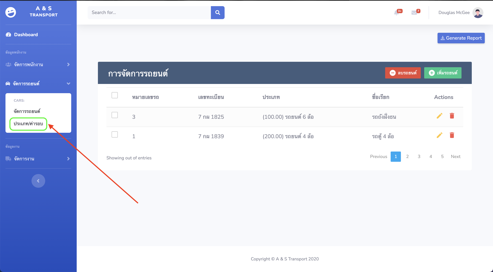
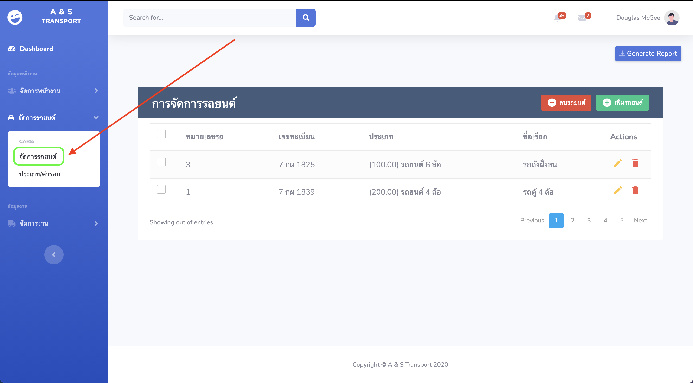
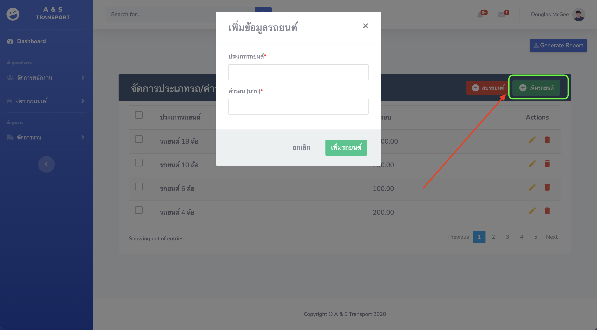
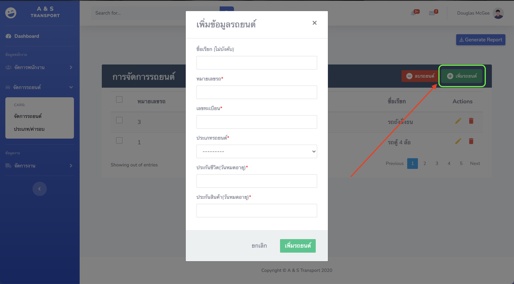
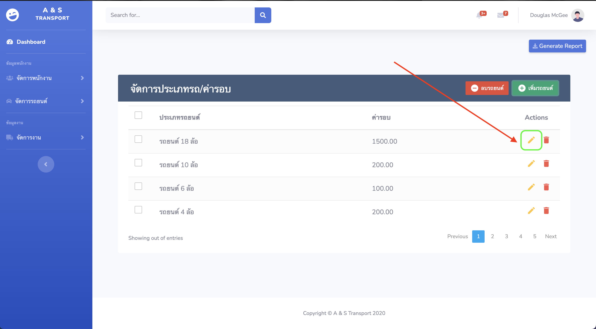
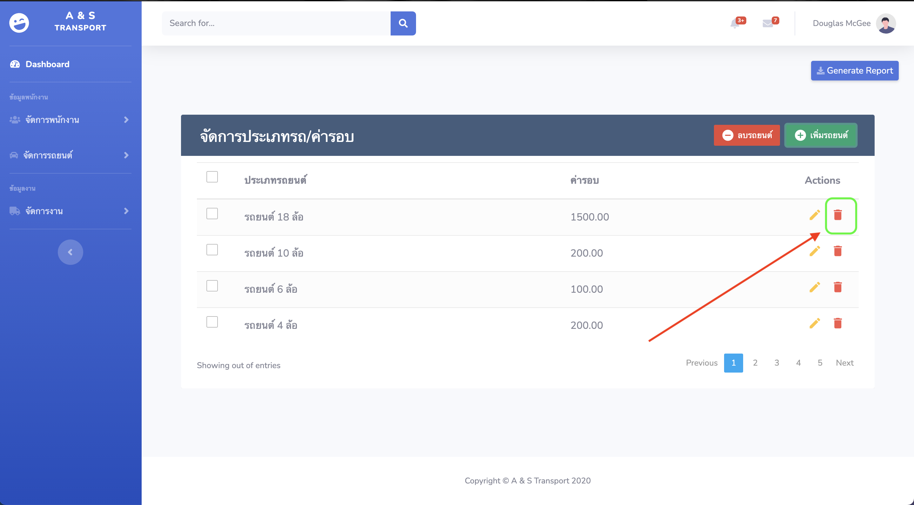

## เมนูจัดการรถในบริษัท

---

### 1.การเข้าเมนูจัดการรถในบริษัท

_เมนูการจัดการรถในบริษัทแบ่งออกเป็น 2 เมนู ดังนี้_

- เมนูจัดการประเภท/ค่ารอบ ของรถในบริษัท

  

- เมนูจัดข้อมูลรถในบริษัท

  

### 2.การนำเข้าข้อมูลรถในบริษัท

_การนำเข้าข้อมูลรถในบริษัทให้เริ่มนำเข้าข้อมูลตามลำดับดังนี้_

[1] ประเภท/ค่ารอบ ของรถในบริษัท

_*กรอกข้อมูล ประเภท/ค่ารอบ ของรถในบริษัทเพื่อนำไปใช้ในการคำนวณค่ารอบในการออกทำงาน*_

[2] ข้อมูลรถในบริษัท

_*กรอกข้อมูลรถในบริษัทเพื่อนำไปใช้ในการคำนวณค่ารอบในการออกทำงาน (ใช้ในการเลือกรถที่ออกไปพร้อมพนักงาน)*_

### 3.การแก้ไขข้อมูลรถในบริษัท (ประเภท/ค่ารอบ, ข้อมูลรถ)

_การแก้ไขข้อมูล(ประเภท/ค่ารอบ, ข้อมูลรถ)ทำได้โดยเลือกเครื่องหมายรูปดินสอข้างหลังข้อมูลที่ต้องการแก้ไขดังรูป_

_ให้การแก้ไขข้อมูลบนแถบกรอกข้อมูลที่ปรากฏขึ้นมาจากนั้นกดบันทึก_

### 4.การลบข้อมูลรถในบริษัท (ประเภท/ค่ารอบ, ข้อมูลรถ)

_การแก้ไขข้อมูลรถในบริษัท (ประเภท/ค่ารอบ, ข้อมูลรถ)ทำได้โดยเลือกเครื่องหมายรูปถังขยะข้างหลังข้อมูลที่ต้องการลบดังรูป_

