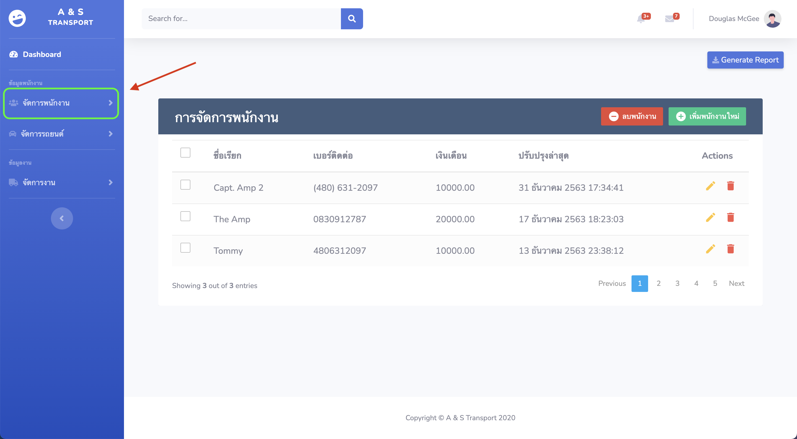
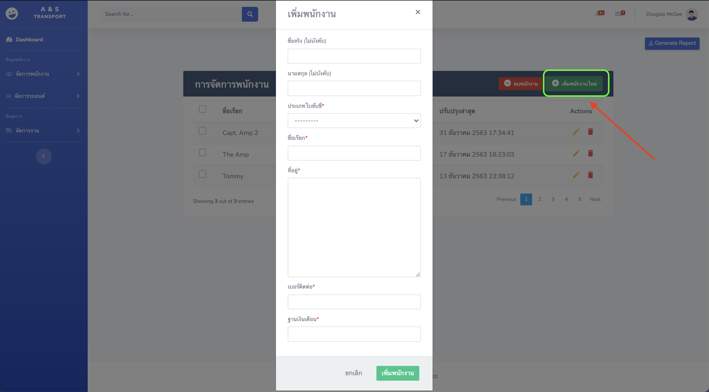
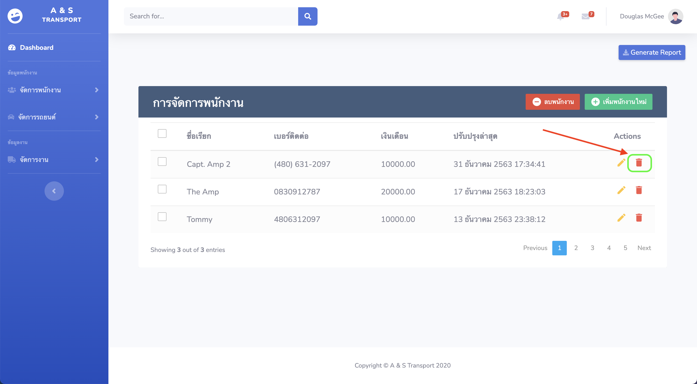

## เมนูจัดการพนักงาน

---

### **1.การเข้าเมนูจัดการพนักงาน**

_ให้ทำการเลือกที่แถบเมนูหัวข้อดังรูป_

### **2.การนำเข้าข้อมูลพนักงาน**

_การนำเข้าข้อมูลพนักงานทำได้โดยเลือกปุ่มเพิ่มพนักงาน_

_การกรอกข้อมูลพนักงาน_

- [ ] ชื่อจริงของพนักงาน
- [ ] นามสกุลจริงของพนักงาน
- [x] ประเภทใบขับขี่ (สามารถเพิ่มในภายหลังได้หากต้องการ)
- [x] ชื่อเรียกใช้ชื่อเรียกอย่างง่าย `(จำง่าย)` เช่น นายดำ, นายแดง
- [x] ที่อยู่พนักงานที่ใช้ติดต่อได้
- [x] เบอร์ติดต่อพนักงาน
- [x] ฐานเงินเดือนพนักงานเพื่อนำไปใช้คำนวณเงินเดือน

_เมื่อกรอกข้อมูลครบถ้วนให้กดปุ่มเพิ่มพนักงานเพื่อทำการบันทึก_

### **3.การแก้ไขข้อมูลพนักงาน**

_การแก้ไขข้อมูลพนักงานทำได้โดยเลือกเครื่องหมายรูปดินสอข้างหลังข้อมูลที่ต้องการแก้ไขดังรูป_

_ให้การแก้ไขข้อมูลบนแถบกรอกข้อมูลที่ปรากฏขึ้นมาจากนั้นกดบันทึก_

### **4.การลบข้อมูลพนักงาน**

_การแก้ไขข้อมูลพนักงานทำได้โดยเลือกเครื่องหมายรูปถังขยะข้างหลังข้อมูลที่ต้องการลบดังรูป_

