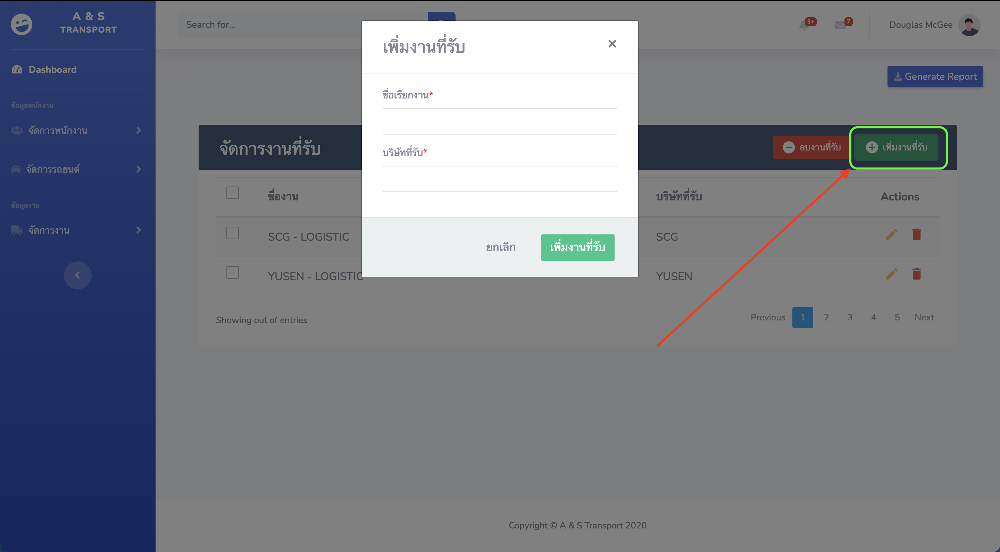

## เมนูจัดการงานในบริษัท

---

### 1.การเข้าเมนูจัดการงานในบริษัท

_เมนูการจัดการงานในบริษัทแบ่งออกเป็น 2 เมนู ดังนี้_

- เมนูจัดการข้อมูลงานที่รับเช่น รับงานจาก SCG, etc..

  

- เมนูจัดข้อมูลงานของพนักงาน

  

### 2.การนำเข้าข้อมูลงานในบริษัท

_การนำเข้าข้อมูลงานในบริษัทให้เริ่มนำเข้าข้อมูลตามลำดับดังนี้_

[1] งานที่รับมาจากบริษัท เช่น รับงานจาก SCG, etc..

_*กรอกข้อมูลงานที่รับมาจากบริษัทใช้ในการเก็บประวัติของงานที่ทำ*_

[2] ข้อมูลงานของพนักงาน

_*กรอกข้อมูลงานของพนักงานที่ทำในแต่ละรอบ โดยในการกรอกข้อมูลจะมีตัวอย่างรายละเอียดการกรอกงานเพิ่มเติมดังนี้*_

_*การกรอกข้อมูลงานเพิ่มเติมให้กรอกในกรอบสีเขียวให้ครบถ้วนจากให้ให้กดเครื่องหมาย "+" เพื่อเพิ่มงานเพิ่มเติม (เช่น ค่าแพ๊คกล่อง, ค่าเด็กนั่งรถ)*_

_*หลังจากบันทึกข้อมูลงานของพนักงานจะเห็นว่ามีข้อมูลงวดงานและยอดเงินในรอบปรากฏขึ้นมีรายละเอียดดังนี้*_

- งวดงาน

  - งวดที่ 1 วันที่ 26 - 10 ของเดือน
  - งวดที่ 2 วันที่ 11 - 25 ของเดือน

- ยอดเงินในรอบ ประกอบด้วย
  - ค่ารอบของรถที่ออก (จากหัวข้อประเภทรถ เช่น รถ 4 ล้อ )
  - ค่างานเพิ่มเติมในแต่บละรอบ (เช่น ค่าแพ๊คกล่อง, ค่าเด็กนั่งรถ)

---

# อยู่ระหว่างการพัฒนา

### 3.การเรียกดูข้อมูลงานในบริษัท (แต่ละรอบ)

### 4.การแก้ไขข้อมูลงานในบริษัท (งานที่รับมาจากบริษัท, งานของพนักงาน)

### 5.การลบข้อมูลงานในบริษัท
